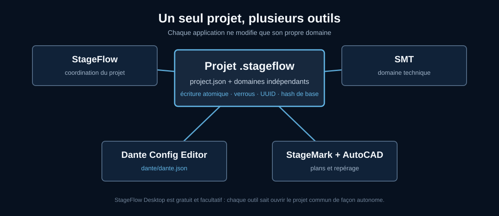

  

<h1 align="center">Dante Config Editor</h1>

  <strong>Préparez et modifiez vos configurations Dante hors ligne, dans une vue claire.</strong>

  <a href="https://github.com/Mamat79/Dante-Config-Editor/releases/latest"><strong>⬇ Télécharger DCE pour Windows</strong></a>
  ·
  <a href="manuals/Notice_DanteConfigEditorV3_FR.pdf">Notice complète</a>
  ·
  <a href="README_EN.md">English</a>

---

## DCE, à quoi ça sert ?

Dante Config Editor, ou **DCE**, est un logiciel de préparation hors ligne pour
les réseaux audio Dante.

Il permet d’ouvrir un XML Dante Controller, de comprendre rapidement le contenu
d’une installation, de corriger les noms, de préparer le patch et de fusionner
plusieurs projets sans devoir connecter les machines.

DCE est particulièrement utile pour préparer une installation avant d’arriver
sur site, documenter un réseau existant, appliquer de nombreux changements
répétitifs ou vérifier un fichier avant de le remettre à Dante Controller.

## Un exemple concret

Vous devez préparer un festival avec une console, plusieurs racks de scène, un
ordinateur d’enregistrement et des amplificateurs réseau :

1. ouvrez le XML de référence dans DCE ;
2. visualisez les machines, leurs canaux TX/RX et les subscriptions ;
3. renommez les rôles et les canaux, à l’unité ou en série ;
4. préparez le patch dans la matrice ou avec Easy Patch ;
5. ajoutez les machines manquantes depuis la banque ;
6. lancez la vérification du projet ;
7. exportez le XML final et ouvrez-le dans Dante Controller avant exploitation.

Vous pouvez préparer l’essentiel au bureau et réserver le temps sur site aux
contrôles réels : câblage, horloge, réseau et audio.

## Ce que DCE permet de faire

### Voir toute l’installation

DCE rassemble dans une seule interface les machines, canaux TX/RX,
subscriptions, formats audio, latences, fréquences d’échantillonnage,
Preferred Masters et informations réseau disponibles dans le fichier.

La vue d’ensemble aide à repérer rapidement les machines sans patch, les
réglages différents ou les références à contrôler.

### Renommer rapidement

- Renommer les machines et les canaux directement.
- Appliquer une série numérique à une sélection.
- Conserver les zéros dans des noms comme <code>Mic 01</code>.
- Prolonger des paires stéréo comme <code>FX-1L</code>,
  <code>FX-1R</code>, <code>FX-2L</code>, <code>FX-2R</code>.
- Dupliquer ou réorganiser un rôle sans recommencer tout le projet.

### Préparer le patch

- Matrice de patch compacte.
- Easy Patch par sélection ou plage 1:1.
- Patch à l’unité, vertical ou diagonal.
- Recherche de la source d’un RX.
- Affichage des destinations d’un TX.
- FLIP RX/TX entre deux machines.
- Réinitialisation ciblée d’une partie du patch.

### Fusionner plusieurs projets

DCE peut ajouter le contenu d’un second XML dans le projet ouvert. Il vous aide
à résoudre les conflits de noms et à réutiliser ou renommer les rôles importés.

Cette fonction est pratique pour réunir des préparations provenant de plusieurs
équipes ou plusieurs zones d’une installation.

### Préparer des machines sans les avoir sous la main

La banque de machines permet d’ajouter des modèles réutilisables pour préparer
un projet hors ligne. La banque communautaire comprend des profils de consoles,
racks, interfaces, amplificateurs et équipements réseau audio.

### Vérifier et documenter

- Assistant de contrôle avant export.
- Erreurs et avertissements regroupés par gravité.
- Rapports TXT ou PDF.
- Patchbooks et comparaisons avant/après.
- Import et export de labels avec Excel, CSV, JSON et ODS.
- Synoptique exportable en PDF ou SVG.

## Un seul projet avec les autres outils SiLeMI/O

DCE utilise le dossier <code>.stageflow</code> comme projet natif. Il peut créer
et ouvrir ce projet de manière autonome : StageFlow Desktop n’est pas
obligatoire.

Le même projet peut ensuite être utilisé avec SMT, StageMark, StageFlow et
AutoCAD sans multiplier les fichiers contradictoires.

- [StageFlow — patch, groupes, Excel et plan de scène](https://github.com/Mamat79/SiLeMIO-StageFlow-Distribution/releases/latest)
- [SMT — transfert entre consoles et logiciels](https://github.com/Mamat79/Save-My-Time-SMT/releases/latest)
- [StageMark — implantation et projection](https://github.com/Mamat79/StageMark/releases/latest)

## Les formats à connaître

- **Projet <code>.stageflow</code>** : projet natif partagé avec la suite
  SiLeMI/O.
- **XML Dante** : fichier d’échange destiné à Dante Controller.
- **Projet historique <code>.dceproj</code>** : ancien format DCE toujours
  ouvrable.
- **Banque de machines** : collection de modèles réutilisables pour préparer un
  projet.

## Télécharger et démarrer

La version actuelle est proposée pour **Windows 11 x64**.

| Ressource | Lien |
|---|---|
| Installateur Windows | [Télécharger la dernière version](https://github.com/Mamat79/Dante-Config-Editor/releases/latest) |
| Démarrage rapide | [PDF français](manuals/QuickStart_DanteConfigEditorV3_FR.pdf) |
| Notice complète | [PDF français](manuals/Notice_DanteConfigEditorV3_FR.pdf) |
| Banque communautaire | [Téléchargement dans la dernière Release](https://github.com/Mamat79/Dante-Config-Editor/releases/latest) |

Au premier lancement, l’écran **Découvrir DCE** permet d’ouvrir un XML, créer un
projet, découvrir la banque ou accéder à la notice.

## Utilisation et licence

DCE offre 30 jours sans rappel au premier lancement. Ensuite, le logiciel et ses
fonctions restent utilisables ; un rappel apparaît simplement au démarrage.

Une licence permanente à **29 € TTC**, en paiement unique, supprime ce rappel.

**[Acheter une licence permanente DCE](https://dce-license.mamat79-dce.workers.dev/buy)**

## À savoir avant une exploitation

DCE est un outil tiers indépendant, sans affiliation avec Audinate. Il prépare
des fichiers hors ligne et ne pilote pas directement un réseau Dante.

Travaillez sur une copie, ouvrez le XML obtenu dans Dante Controller et vérifiez
la configuration sur le matériel réel avant toute exploitation importante.

---

  <strong>SiLeMI/O</strong> 
  By Mamat 
  <code>-------[]--</code>

