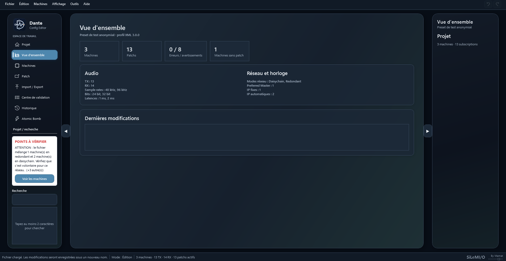
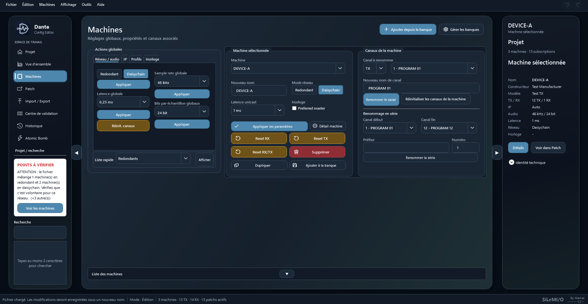
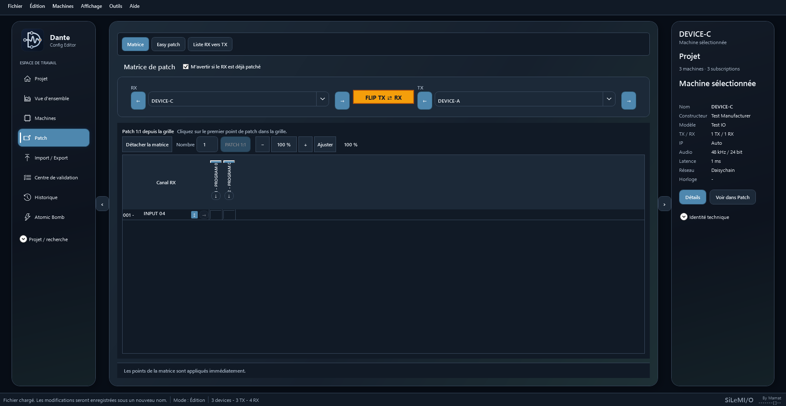
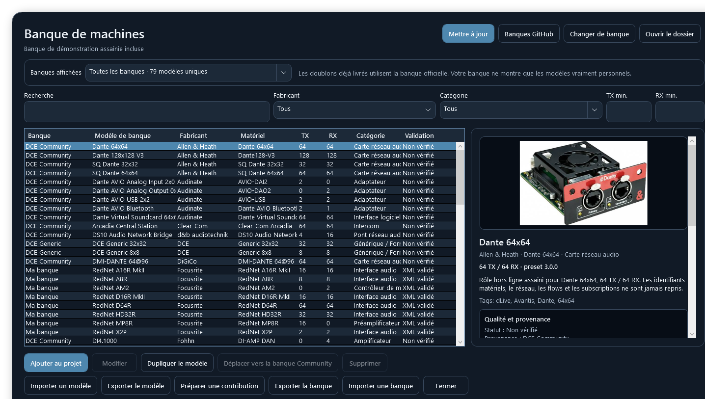
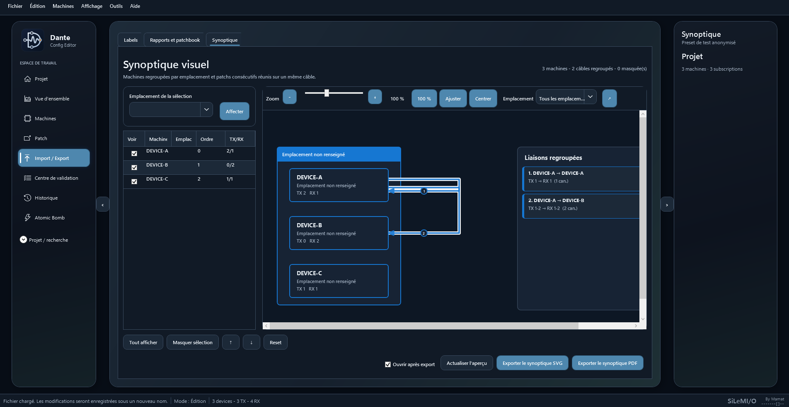

  

<h1 align="center">Dante Config Editor</h1>

  <strong>Préparer, vérifier, modifier, fusionner et patcher des configurations
  Dante hors ligne, sans connecter les machines.</strong>

  <a href="https://github.com/Mamat79/Dante-Config-Editor/releases/download/v2026.5/DanteConfigEditor2026_5_Installer.exe"><strong>Télécharger pour Windows</strong></a>
  ·
  <a href="https://github.com/Mamat79/Dante-Config-Editor/releases/download/v2026.5/DCE-2026.5-Presentation-Rapide-FR.mkv"><strong>Voir la présentation</strong></a>
  ·
  <a href="https://github.com/Mamat79/Dante-Config-Editor/releases/download/v2026.5/Notice_DanteConfigEditorV3_FR.pdf"><strong>Lire la notice</strong></a>

  Français · <a href="README_EN.md">English</a>

---

## L’essentiel

**DCE 2026.5** est un éditeur de projets XML Dante Controller conçu pour les
préparations hors ligne, les contrôles rapides et les modifications répétitives
qui demandent habituellement d’ouvrir de nombreuses pages dans Dante
Controller.

Dans une seule interface, DCE rassemble les machines, canaux TX/RX,
subscriptions, latences, fréquences d’échantillonnage, formats audio, modes
réseau, Preferred Masters et adresses IP. Il permet de modifier ce que le XML
expose réellement, puis d’enregistrer un nouveau fichier destiné à Dante
Controller.

## Télécharger, voir et apprendre

| Ressource | Lien direct |
| --- | --- |
| **Installateur Windows 11 x64** | [DanteConfigEditor2026_5_Installer.exe](https://github.com/Mamat79/Dante-Config-Editor/releases/download/v2026.5/DanteConfigEditor2026_5_Installer.exe) |
| Présentation rapide, 2 min 12 s | [Vidéo MKV en français](https://github.com/Mamat79/Dante-Config-Editor/releases/download/v2026.5/DCE-2026.5-Presentation-Rapide-FR.mkv) |
| Guide visuel complet, 10 min 38 s | [Vidéo MKV en français](https://github.com/Mamat79/Dante-Config-Editor/releases/download/v2026.5/DCE-2026.5-Guide-Visuel-Complet-FR.mkv) |
| Démarrage rapide | [PDF français](https://github.com/Mamat79/Dante-Config-Editor/releases/download/v2026.5/QuickStart_DanteConfigEditorV3_FR.pdf) |
| Notice complète | [PDF français](https://github.com/Mamat79/Dante-Config-Editor/releases/download/v2026.5/Notice_DanteConfigEditorV3_FR.pdf) |
| Contrôle des téléchargements | [Sommes SHA-256](https://github.com/Mamat79/Dante-Config-Editor/releases/download/v2026.5/SHA256SUMS.txt) |
| Toutes les pièces de la version | [Release DCE 2026.5](https://github.com/Mamat79/Dante-Config-Editor/releases/tag/v2026.5) |

Les vidéos MKV contiennent une piste de sous-titres sélectionnable et
modifiable. Les sous-titres ne sont pas incrustés dans l’image.

DCE a également été testé et validé sur un Mac réel par le mainteneur. La
Release publique fournit actuellement l’installateur Windows ; le prochain
paquet macOS sera ajouté à cette page dès sa compilation de distribution.

## Pourquoi utiliser DCE ?

### Voir rapidement toute une installation

DCE donne une vue synthétique du projet et signale les éléments à contrôler :
formats audio différents, modes réseau mélangés, Preferred Masters multiples,
IP fixes, machines sans patch ou références incohérentes.

### Renommer sans refaire tout le patch

Les machines, TX et RX peuvent être renommés directement ou en série. Pour les
références reconnues, DCE met à jour les subscriptions concernées afin de ne pas
perdre le patch existant. Les séries numériques conservent les zéros et peuvent
enchaîner des paires stéréo comme `FX-1L`, `FX-1R`, `FX-2L`, `FX-2R`.

### Fusionner plusieurs installations

Un second XML peut être ajouté au projet ouvert. DCE détecte les conflits de
noms et d’identités, permet de réutiliser les rôles déjà présents ou de renommer
les rôles importés, puis redirige les références de patch reconnues.

### Préparer un projet sans les machines

DCE peut partir d’un XML existant ou créer un projet hors ligne. Des rôles
assainis peuvent être ajoutés depuis la banque de machines, sans recopier une
identité matérielle, une IP, des flows ou des subscriptions provenant d’un autre
réseau.

## Fonctions principales

### Machines et actions globales

- renommer, dupliquer, supprimer ou réinitialiser prudemment un rôle ;
- renommer les canaux TX et RX à l’unité ou en série ;
- modifier les réglages audio, réseau, horloge, latence et Preferred Master
  réellement présents dans le XML ;
- appliquer un profil ou une même action à plusieurs machines ;
- indiquer clairement quand une propriété n’est pas disponible pour un rôle.

### Patch rapide et lisible

- Matrice de patch compacte avec zoom et fenêtre détachable ;
- Easy Patch pour travailler par sélection ou par plage 1:1 ;
- patch immédiat à l’unité, verticalement ou en diagonale selon le résultat
  valide attendu ;
- FLIP RX/TX entre les deux machines affichées ;
- recherche de la source d’un RX ;
- affichage de toutes les destinations d’un TX et navigation vers celle choisie ;
- reset RX, TX ou RX/TX d’une machine.

### Validation et sauvegarde sécurisée

- garde-fous contre les identités manquantes ou dupliquées ;
- détection des références de patch incohérentes ;
- conservation des namespaces, attributs, valeurs et balises inconnues ;
- annulation, rétablissement et récupération automatique ;
- écriture temporaire, relecture, validation, sauvegarde de l’ancienne
  destination puis remplacement sûr.

DCE ne fabrique pas silencieusement des balises techniques absentes. Une action
non prise en charge est désactivée ou refusée avec une explication.

### Banques de machines

- catalogue simplifié en trois sources : `Ma banque`, `DCE Community` et
  `DCE Generic` ;
- sélection automatique de la génération officielle la plus récente, sans
  afficher les anciennes copies ni les doublons ;
- banques personnelles ou partagées toujours préservées ;
- recherche par fabricant, catégorie et capacités TX/RX ;
- ajout de plusieurs rôles en une seule opération ;
- modèles indépendants du projet après insertion ;
- mise à jour des banques publiques avec contrôle SHA-256 ;
- conservation systématique de la banque personnelle pendant les mises à jour.

### Rapports, labels et synoptique

- rapports TXT/PDF, patchbooks et comparaisons avant/après ;
- import/export de labels JSON, CSV, XLSX et ODS ;
- échanges de labels avec les workflows DMT, Allen & Heath dLive/Avantis et
  Yamaha CL/QL ;
- synoptique coloré avec emplacements, machines et liaisons regroupées ;
- export du synoptique en PDF ou SVG pour retouche dans un logiciel vectoriel.

## Trois formats à distinguer

- **XML Dante** : fichier destiné à Dante Controller. DCE effectue des
  modifications ciblées du document chargé.
- **Projet `.dceproj`** : espace de travail DCE pouvant conserver présentation,
  historique et informations propres à DCE. Il faut exporter son XML avant de
  l’utiliser dans Dante Controller.
- **Banque de machines** : ensemble de modèles réutilisables et partageables,
  sans identité matérielle de production.

## Licence permanente

- **30 jours sans aucun rappel** au premier démarrage ;
- après 30 jours, **DCE et toutes ses fonctions restent utilisables** ;
- un rappel non bloquant apparaît simplement au lancement ;
- une licence permanente à **29 €** supprime ce rappel ;
- le code signé est vérifié localement et reste valable après les mises à jour.

[Acheter une licence permanente avec Stripe](https://dce-license.mamat79-dce.workers.dev/buy)

Le paiement est traité par Stripe. DCE ne reçoit aucune donnée bancaire et la
vérification du code de licence fonctionne hors ligne.

## Compatibilité et limites

Les XML produits par cette génération ont été importés avec succès dans Dante
Controller par le mainteneur. Les tests automatisés vérifient également les
cycles ouverture/enregistrement/réouverture, les références croisées, les
namespaces, les valeurs inconnues et les opérations transactionnelles. DCE a
également été testé et validé sur macOS par le mainteneur.

> DCE est un outil tiers non officiel, sans affiliation avec Audinate. Il ne
> contrôle pas un réseau Dante en direct et n’utilise ni SDK ni API Audinate.
> Travaillez sur une copie et contrôlez le XML final dans Dante Controller avant
> son utilisation sur une installation importante.

## Remerciements

Merci à [Tobi / @togrupe](https://github.com/togrupe), auteur de
[dLive MIDI Tools](https://github.com/togrupe/dlive-midi-tools), pour ses
retours et ses idées sur les workflows de patch et les échanges de labels.

Merci à Charles Bouticourt pour l’idée de la fonction de formation
**Atomic Bomb**.

---

  <strong>SiLeMI/O</strong> 
  By Mamat 
  <code>-------[]--</code>

