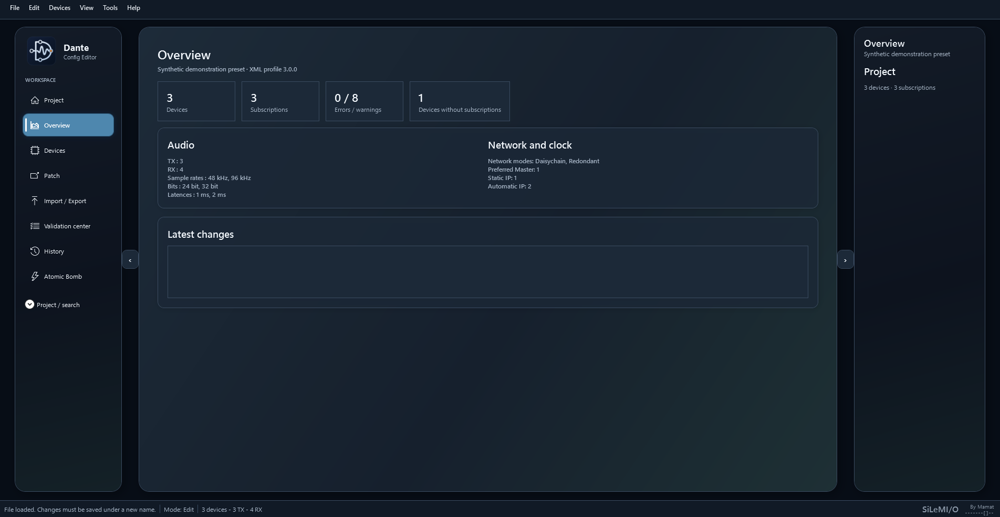
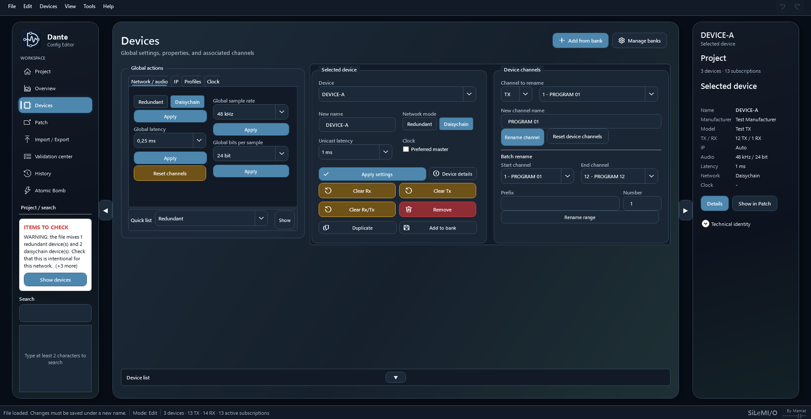
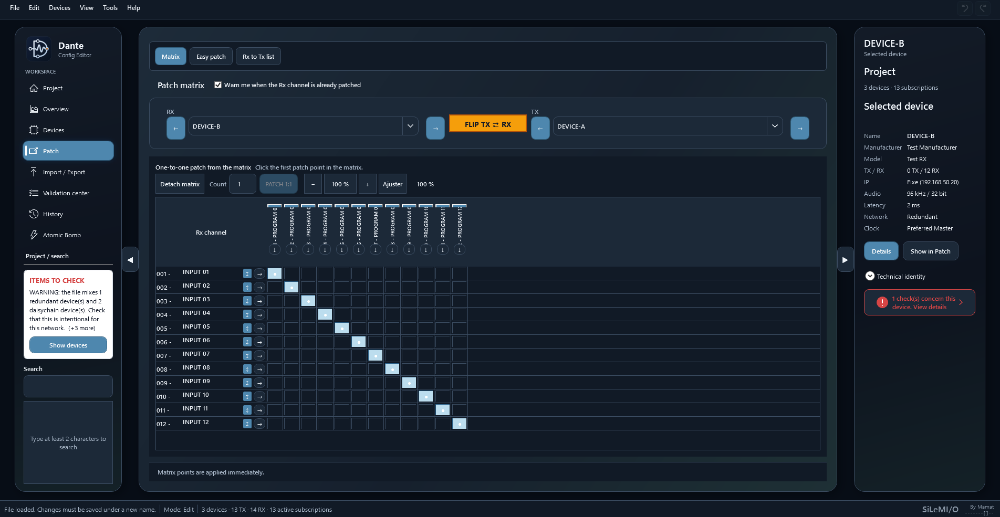
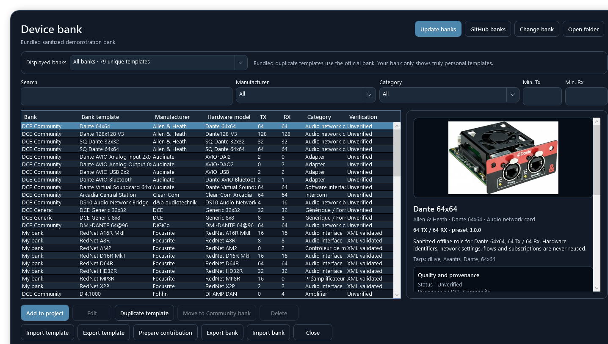
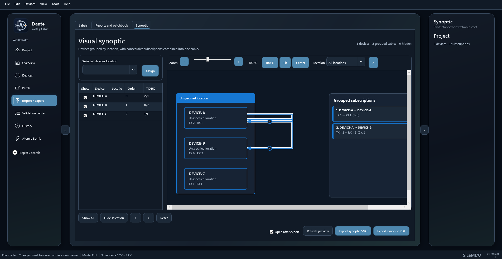

  

<h1 align="center">Dante Config Editor</h1>

  <strong>Prepare and edit Dante configurations offline, from one clear view.</strong>

  <a href="https://github.com/Mamat79/Dante-Config-Editor/releases/download/v2027.0.1/DanteConfigEditor2027_Installer.exe"><strong>Windows 2027.0.1</strong></a>
  ·
  <a href="https://github.com/Mamat79/Dante-Config-Editor/releases/download/v2027.0/DanteConfigEditor2027_macOS_AppleSilicon.dmg"><strong>macOS Apple Silicon 2027.0</strong></a>
  ·
  <a href="https://github.com/Mamat79/Dante-Config-Editor/releases/download/v2027.0/DanteConfigEditor2027_macOS_Intel.dmg"><strong>macOS Intel 2027.0</strong></a>
  ·
  <a href="manuals/Notice_DanteConfigEditorV3_EN.pdf">Windows guide</a>
  ·
  <a href="https://github.com/Mamat79/Dante-Config-Editor/releases/download/v2027.0/Notice_DanteConfigEditorV3_EN.pdf">Mac guide</a>
  ·
  <a href="manuals/SiLeMIO-Suite-Guide-EN.pdf">Suite guide</a>
  ·
  <a href="README.md">Français</a>

   
  <a href="https://github.com/Mamat79/Dante-Config-Editor/releases/download/v2027.0.1/dante-config-editor-presentation-en.mp4">Presentation · EN</a>
  · <a href="https://github.com/Mamat79/Dante-Config-Editor/releases/download/v2027.0.1/dante-config-editor-presentation-en.vtt">EN captions</a>
  · <a href="https://github.com/Mamat79/Dante-Config-Editor/releases/download/v2027.0.1/dante-config-editor-presentation-fr.mp4">Présentation · FR</a>

---

## What is Dante Config Editor for?

Dante Config Editor, or **DCE**, is an offline preparation tool for Dante audio
networks.

It opens Dante Controller XML files and provides a clear view of devices, TX/RX
channels and subscriptions. You can rename items, prepare the patch, merge
projects and add reusable device models without connecting the actual hardware.

**Rename without losing your patch.** When you rename a device or channel,
DCE updates the affected subscription references. You can also start from
scratch using the device catalogue, then export the configuration to Dante
Controller.

DCE is useful for preparing an installation before arriving on site,
documenting an existing network, applying repetitive changes and checking a
file before opening it in Dante Controller.

The presentation screenshots show the Windows interface. The editing
workflows are also available on Mac, with a macOS-specific layout.

## A typical workflow

1. Open the reference Dante XML file.
2. Review devices, TX/RX channels and subscriptions.
3. Rename roles and channels individually or as a series.
4. Prepare routing in the patch matrix or with Easy Patch.
5. Add missing devices from the reusable catalogue.
6. Run the project checks.
7. Export the final XML and open it in Dante Controller before operation.

This keeps on-site time focused on the real system: cabling, clocking, network
status and audio checks.

## Main features

### Understand the whole installation

DCE brings together the devices, channels, subscriptions, audio formats,
latencies, sample rates, Preferred Masters and network information available
in the file.

Recognised properties can be edited per device or through global actions:
sample rate, latency, audio format, redundant/daisychain mode, clocking and IP
addressing. Settings unsupported by the profile remain unavailable with an
explanation; DCE does not invent hardware capabilities.

### Rename quickly

- Rename devices and channels directly.
- Apply numbered series to a selection.
- Preserve leading zeroes.
- Continue stereo pairs such as <code>FX-1L</code>,
  <code>FX-1R</code>, <code>FX-2L</code>, <code>FX-2R</code>.
- Duplicate and reorganise roles without rebuilding the project.

### Prepare routing

- Compact patch matrix.
- Easy Patch by selection or 1:1 range.
- Single, vertical and diagonal patch actions.
- Find the source connected to an RX channel.
- Display every destination of a TX channel.
- Flip the displayed RX/TX devices.
- Reset only the required part of a patch.

### Merge projects

A second XML file can be added to the open project. DCE helps resolve naming
conflicts and reuse or rename imported roles.

### Work without the devices

The device catalogue provides reusable console, stagebox, interface, amplifier
and network-audio profiles for offline preparation.

### Check and document

- Pre-export project checks.
- Errors and warnings grouped by severity.
- TXT and PDF reports.
- Patchbooks and before/after comparisons.
- Label exchange with Excel, CSV, JSON and ODS.
- Synoptic export to PDF or SVG.

## One project with the SiLeMI/O suite

DCE can work independently on a Dante XML configuration, open a local
<code>.stageflow</code> folder, or explicitly join a StageFlow LIVE session.
These three workflows remain separate. StageFlow is free and optional, never
required to prepare a Dante configuration.

If a StageFlow project does not contain a Dante configuration yet, DCE
immediately offers **Start from scratch**, **Open Dante XML**, or **Later**.
Starting from scratch creates the first custom or catalogue device. When saved,
DCE adds only its Dante domain and preserves every other application's data.

The same project can later be used with StageDesk, subtitled **Save My Time**, StageMark, StageFlow,
StageMon and AutoCAD.

### Map a StageFlow patch to Dante RX channels and follow it LIVE

A StageFlow patch group can directly name all or part
of a Dante device's RX channels:

1. open the `.stageflow` project in DCE;
2. choose the group and naming mode: source, microphone, source + microphone,
   or StageFlow label;
3. choose the device, first RX channel, and number of channels;
4. review the Before / After preview, then apply.

DCE resolves common pairs, group overrides, and hidden pairs. Empty cells are
ignored, and nothing changes before confirmation. This workflow also works
when DCE is used on its own, without StageFlow.

### One clear connection center on Windows and Mac

The **StageFlow LIVE** button is accessible at the top of the window and
opens the connection center. Three workflows remain
distinct:

- **Standalone DCE**: prepare your configuration without StageFlow.
- **Local `.stageflow` project**: share a project folder while preserving each
  application's own data.
- **Temporary LIVE session**: select a StageFlow host on your local network,
  check the project name, then enter its six-digit code.

If discovery is unavailable, enter the host's private IPv4 address and port.
A code error stays in the window so you can try again. Leaving a session is
explicit; DCE does not automatically rejoin after a connection loss.

Linked RX changes use **explicit UUIDs**, never name matching. A missing rule,
unsaved local changes or a conflict rejects the complete transaction and
retains the last valid state.

An **orange banner, visible on every page**, shows received changes with the
old and new labels, origin and time. Acknowledging one alert or all currently
displayed alerts only affects your computer; a newly arriving alert remains
unread. You can disable notifications without leaving LIVE. A host-controlled
notification pause is shown separately and does not interrupt the connection.

**LIVE synchronises the project, not Dante hardware.** Use it on a trusted
local network. The local StageFlow console, which controls applications on
the same computer, remains Windows-only; local projects and DCE's LAN
connection center are also available on Mac.

- [StageFlow — patch lists, groups, Excel and stage plan](https://github.com/Mamat79/StageFlow)
- [StageDesk — Save My Time · transfer between consoles and software](https://github.com/Mamat79/StageDesk/releases/latest)
- [StageMark — placement and projection](https://github.com/Mamat79/StageMark/releases/latest)
- [StageMon — live monitoring matrix](https://github.com/Mamat79/StageMon/releases/latest)

## File formats

- **<code>.stageflow</code> project**: native project shared across the
  SiLeMI/O suite.
- **Dante XML**: exchange file intended for Dante Controller.
- **Legacy <code>.dceproj</code>**: previous DCE project format, still
  supported.
- **Device catalogue**: reusable models for offline preparation.

## Download and start

**Dante Config Editor v2027 is available for Windows and Mac.**
The latest published version is **2027.0.1 for Windows** and **2027.0 for Mac**
(Apple Silicon and Intel). The links below point to the public files for your
computer; no Mac 2027.0.1 package is being distributed.

| Resource | Link |
|---|---|
| Windows x64 installer | [Direct download](https://github.com/Mamat79/Dante-Config-Editor/releases/download/v2027.0.1/DanteConfigEditor2027_Installer.exe) |
| macOS Apple Silicon | [Download DMG](https://github.com/Mamat79/Dante-Config-Editor/releases/download/v2027.0/DanteConfigEditor2027_macOS_AppleSilicon.dmg) |
| macOS Intel | [Download DMG](https://github.com/Mamat79/Dante-Config-Editor/releases/download/v2027.0/DanteConfigEditor2027_macOS_Intel.dmg) |
| Windows quick start | [English PDF](manuals/QuickStart_DanteConfigEditorV3_EN.pdf) |
| Windows full guide | [English PDF](manuals/Notice_DanteConfigEditorV3_EN.pdf) |
| Mac quick start | [English PDF](https://github.com/Mamat79/Dante-Config-Editor/releases/download/v2027.0/QuickStart_DanteConfigEditorV3_EN.pdf) |
| Mac full guide | [English PDF](https://github.com/Mamat79/Dante-Config-Editor/releases/download/v2027.0/Notice_DanteConfigEditorV3_EN.pdf) |
| Suite guide | [English PDF](manuals/SiLeMIO-Suite-Guide-EN.pdf) · [PDF français](manuals/Guide-Suite-SiLeMIO-FR.pdf) |
| Community device catalogue | [Download the catalogue](https://github.com/Mamat79/Dante-Config-Editor/releases/download/v2027.0.1/DCE_Community_Devices_2026_3.dce-bank.zip) |
| Changes and limitations | [Windows 2027.0.1 and public Mac versions](RELEASE_NOTES_2027.0.1.md#english) |
| File verification | [SHA-256](https://github.com/Mamat79/Dante-Config-Editor/releases/download/v2027.0.1/SHA256SUMS.txt) |
| Release verification | [Tests and limitations](VALIDATION_2027.0.1.md) |

The **Discover DCE** screen provides direct access to opening an XML file,
creating a project, browsing the catalogue and reading the guide.

The Windows 2027.0.1 installer includes the FR/EN full guides and quick starts,
plus both shared suite guides. The Mac links retain the documentation shipped
with Mac 2027.0. Videos introduce the general workflows; use the manual matching
your installed version for its commands.

Windows offers matrix fill handles for series renaming. Mac uses a series
renaming panel with numbered and stereo sequences. Shared editing functions
do not imply an identical interface.

On Windows 2027.0.1, XML export in **Save as** produces a separate Dante file.
**Save** updates the StageFlow project's Dante domain. The Mac 2027.0.1 update
still awaits verification and is not presented as available.

The shared public name is **v2027**. The technical tags are **v2027.0.1** for
Windows and **v2027.0** for Mac. Use this page's direct links: GitHub's global
**Latest** marker temporarily stays on the older release to preserve historical
updaters. From Windows 2026.10, download the installer above manually to move
to v2027. Windows 2027.0.1 then checks for updates matching its own platform.
Windows packages are not yet commercially signed and Mac applications are
not yet notarised by Apple.

## Use and license

DCE starts with 30 reminder-free days. Afterwards, the application and all its
features remain usable; only a startup reminder is displayed.

A permanent **€29 tax-included** one-time license removes this reminder.

**[Buy a permanent DCE license](https://dce-license.mamat79-dce.workers.dev/buy)**

## Before using a configuration

DCE is an independent third-party tool and is not affiliated with Audinate. It
prepares files offline and does not directly control a Dante network.

Work on a copy, open the exported XML in Dante Controller and verify the
configuration on the real hardware before an important production.

---

  <strong>SiLeMI/O</strong> 
  By Mamat 
  <code>-------[]--</code>

